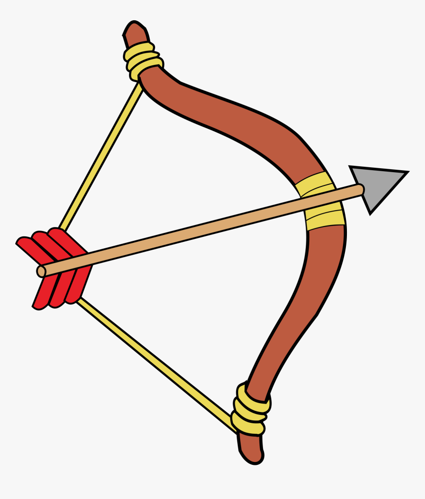

 

  

  <h1 align="center">BowDefense - Unity Game</h1>

## About The Project

  

The project was created for me to understand C# and the basics of the Unity Game Engine(such as coroutine, game animation, game objects, etc). I decided to make this game on quarantine during my summer, as well as other prototypes during my learning phase. Hope you enjoy my game!
   

## Controls

 
Keyboard

> Up arrow or W : Character moves up.

> Down arrow or S: Character moves down.

> Right arrow or D: Character moves to the right.

> Left arrow or A: Character moves to the left.

### Functions

> Clicking on screen: shoots a bullet to the point you clicked as a projectile

> Collecting coins: all coins will spawn in a designated place, touching the coin will pick it up and store it into your inventory

> Gaining health: picking up hearts will increase your hitpoint

> Enemy damage: touching the enemy will reduce you character's hitpoint

 
 

## Video Example

Video Link: 
 
[MOV Format](https://drive.google.com/file/d/1YAlcY96AHLlqEgzZ_Hmgvv2oTM1UOtv-/view?usp=sharing)
 
[MP4 Format](https://drive.google.com/file/d/1YqzQlIvSZ9Lch9eapTZq-5mSQ1J540D9/view?usp=sharing)

 
 
 
 

<!-- GETTING STARTED -->
## Getting Started

To get started, Bow Defense.app, download using the link below. Click "Download All" in the top right corner and unzip to get the .app file. Look at common error if you run into issues.    https://drive.google.com/drive/folders/1KN-TyXkFypgw5MtsMJcMEMnDA0wDUqTq?usp=sharing
 
 
Note: The game is only available one Mac, not Windows.

 
 
 

## Common Error

Double clicking on the run-macos unix application will result in a "developer not trusted error." To fix this, make sure to right click, and then click "Open".

